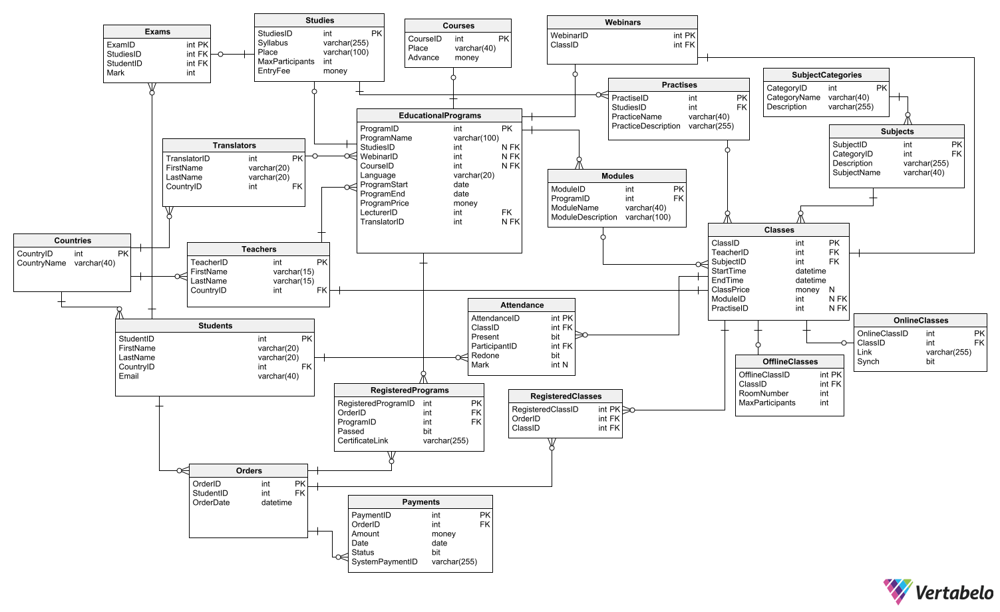

# 🎓 Learning Platform DB

A database model for a hybrid learning platform, developed during the Database Systems course in the 3rd year of university studies. Designed in **MS SQL Server**, including tables, relationships, procedures, functions, triggers, indexes and roles.

## 👥 Team Members:
- **Stas Kochevenko** | skochv04@gmail.com
- **Olgierd Smyka**
- **Bernard Gawor**

## 🗂️ Project Overview
This project focuses on modeling an **educational platform database**, supporting:  
✅ Webinars 🎥  
✅ Courses 📚  
✅ Study programs 🎓  
✅ Payments & User Management 💳  

The database was designed with **MS SQL Server**, implementing **procedures, triggers, views, and functions**.

## 📖 Documentation
For a detailed explanation of the requirements, database schema, functionality, and implementation, see:  
📄 [Project requirements](requirements.pdf)  
📄 [Platform functionality overview](db/functionality.md)  
📄 [Procedures](db/procedures.md)  
📄 [Functions](db/functions.md)  
📄 [Triggers](db/triggers.md)  
📄 [Indexes](db/indexes.md)  
📄 [Roles](db/roles.md)  
