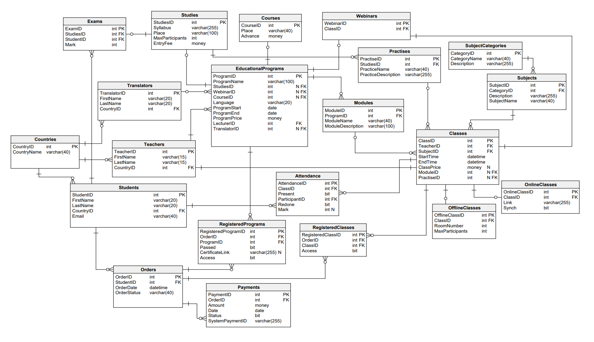

# **Learning Platform Database System**

## Autorzy 

Bernard Gawor, Olgierd Smyka, Stas Kochevenko

## Opis 

Repozytorium służy jako dokumentacja dla projektu zrealizowanego w ramch przedmiotu *Podstawy Baz Danych* na AGH, rok akademicki 2023/24, stworzonego przy użyciu **Microsoft SQL Server**. Zawiera szczegółowe wyjaśnienia dotyczące struktury bazy danych, funkcji, procedur oraz innych istotnych elementów systemu.

## Schemat

## Pliki Projektu

+ [`functionality.md`](functionality.md) - 
Główne funkcjonalności i specyfikacja działanie systemu, funkcjonalności użytkowników systemu.

+ [`tables.md`](tables.md) -
Tabele bazy danych.

+ [`views.md`](views.md) -
Widoki bazy danych.

+ [`functions.md`](functions.md) -
Funkcje bazy danych.

+ [`procedures.md`](procedures.md) - 
Procedury bazy danych.

+ [`report.md`](report.md) -
Całościowe sprawozdanie z realizacji projektu - plik Markdown.

+ [`report.pdf`](report.pdf) -
Całościowe sprawozdanie z realizacji projektu - plik pdf.

+ [`requirements.pdf`](requirements.pdf) -
Opis polecenia, którego rozwiązaniem jest baza danych wraz ze sprawozdaniem [report.pdf](report.pdf).

+ [`schemat.pdf`](schemat.pdf) -
Schemat zaprojektowanej bazy danych, taki jak widoczny powyżej, w formie pliku pdf.